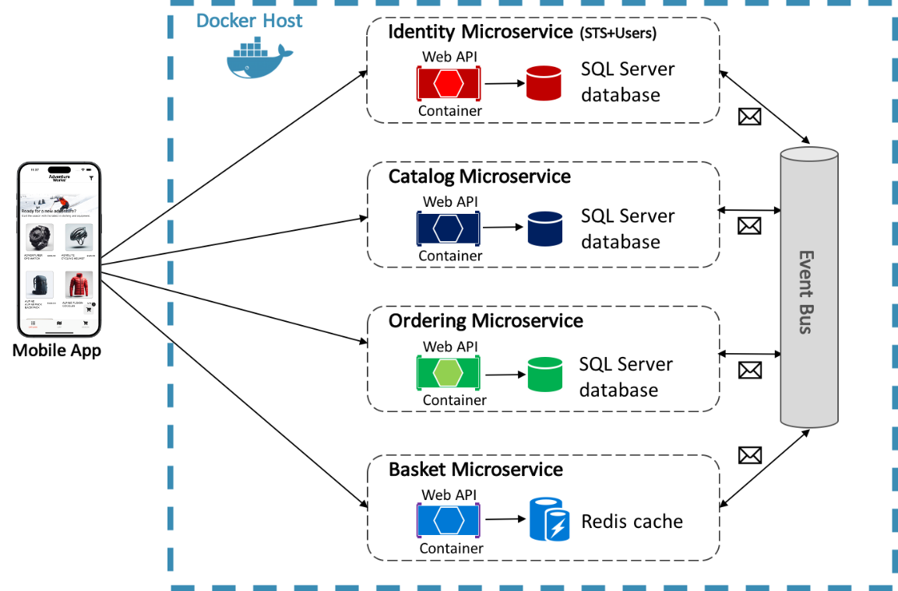

# Containers

- Contenedores. Unidad de software que empaquete el código y todas las dependencias necesarias de una aplicación
- Imagenes. Paquete ligero y ejecutable de software con todo lo necesario para la aplicación
- Docker engine. Motor de ejecución de contenedores.
- Docker Hub. Repositorio por defecto para las imágenes de docker
- Podman. Alternativa opensource a docker
- Docker compose. Orquestador ligero de contenedores
- Docker Swarm. Orquestador de contenedores permite manejar en cluster.
- Kubernetes. Sistema para la administración de clusters y orquestador empresarial de contenedores.

## DOCKER ENGINE

Es la herramienta que nos permite crear contenedores. A través de su CLI podemos interactuar con el engine, existe una herramienta gráfica llamada DOCKER DESKTOP. Lo más común es utilizar el CLI.

> Para ambientes productivos es muy recomendabla configurar la rotación de logs para que no se queden todo el tiempo en el almacenamiento y terminen saturando y afectando la creación de contenedores.

https://docs.docker.com/engine/

> Utilizar los pasos **post-installation** para seguir la guía de configuración de logs. `https://docs.docker.com/engine/install/linux-postinstall/`

## Comunicación entre contenedores

La comunicación entre contenedores Docker se facilita creando y compartiendo una red de Docker, ya sea una red bridge de usuario definida por el usuario o una red gestionada por Docker Compose. Los contenedores en la misma red pueden comunicarse entre sí utilizando sus nombres de contenedor en lugar de sus direcciones IP, lo que simplifica la configuración y mejora la mantenibilidad

## Microservicios

